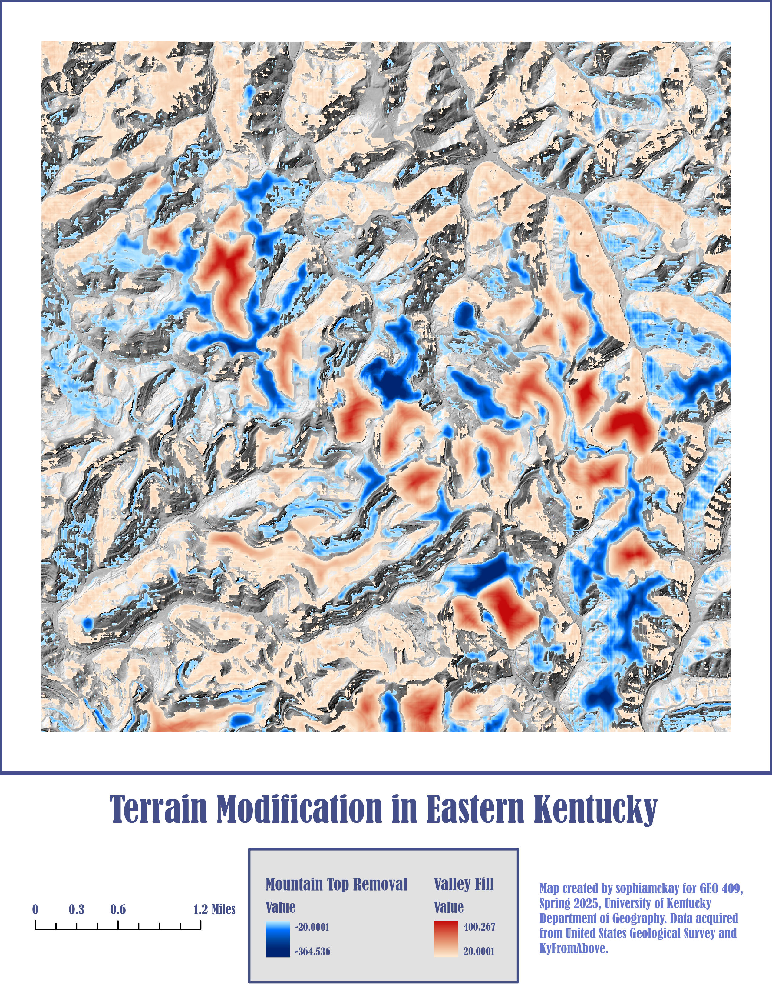
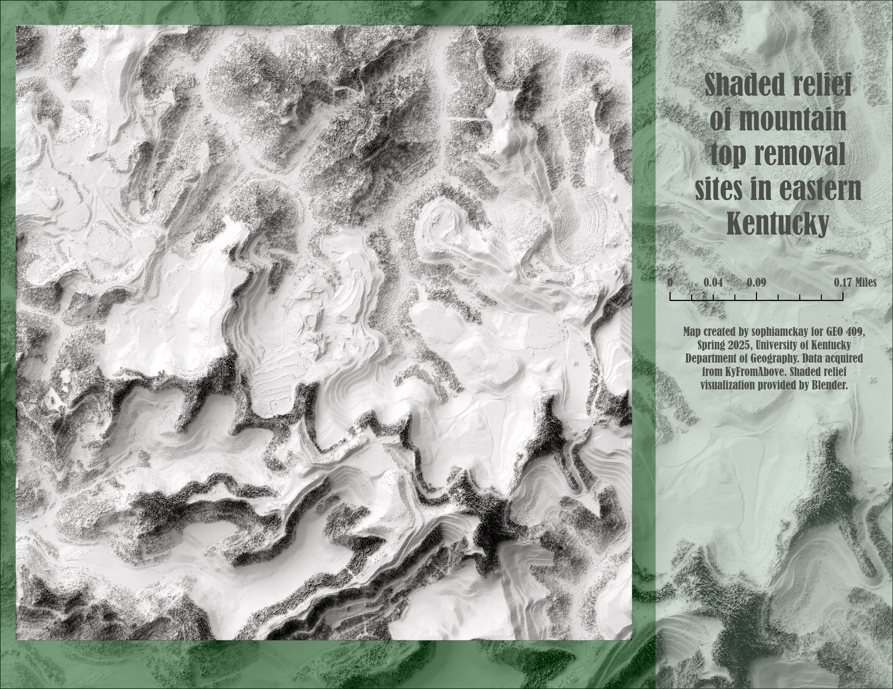

<!DOCTYPE html>
<html>

<head>
  <meta charset="utf-8" />
  <title>Mountaintop removal mining sites in eastern Kentucky</title>
  <meta name="viewport" content="initial-scale=1,maximum-scale=1,user-scalable=no" />
  <link rel="preconnect" href="https://fonts.googleapis.com" />
  <link rel="preconnect" href="https://fonts.gstatic.com" crossorigin />
  <link href="https://fonts.googleapis.com/css2?family=Open+Sans:wght@400;800&display=swap" rel="stylesheet" />
  
</head>

<body>
  <section>
    <!-- 💡💡💡 Cesium map: paste embed code below -->
    <iframe title="GEO 409: Final Project" width="1024" height="576" src="https://ion.cesium.com/stories/viewer/?id=362a872e-b9bb-483a-affc-5f3902777ec9" frameborder="0" allow="fullscreen" allowfullscreen="true" mozallowfullscreen="true" webkitallowfullscreen="true"></iframe>
    <!-- 💡💡💡 Cesium map: paste embed code above -->
    
Lidar pointcloud visualization of eastern Kentucky

    

      <h1>Mountaintop removal mining sites in eastern Kentucky</h1>
      <h2>Ecologically destructive mining practices throughout eastern Kentucky contribute to increased flooding patterns. These maps depict terrain modification between 1990 and 2010 and lack of vegetation at one of these sites.</h2>
    

    

      

        <h3>Background and Relevance</h3>
        

          This specific mining site is just south of Robinson Forest, the University of Kentucky's pristine forest for exploring Appalachian sustainability. Several U.K. students visit for class trips and additional extracirricular activities, and the area boasts one of the cleanest watersheds in eastern Kentucky. However, as demonstrated by this project, Robinson Forest has a close proximity to coal mining sites. 
        

        

          The goal of this project is to measure and visualize the vegetation loss and terrain modification of a coal mining site in eastern Kentucky. Near the Cumberland Plateau especially, mountaintop removal practices have swept through and decimated forests throughout eastern Kentucky. By removing natural vegetation from the tops of mountains, water flowing downhill is able to accumulate on a vaster scale and contribute to unprecedented flooding threats, as witnessed in the summer of 2022.
        

        

          Visualizations created from lidar data provided by
          <a href="https://kyfromabove.ky.gov/">KyFromAbove</a> in ArcGIS Pro and
          Blender.
        

        

          Page and visualizations created by Sophia McKay for GEO 409, Department of
          Geography, University of Kentucky. Spring 2024.
        

      

      

        <h3>Right Column - Vizualizations </h3>
        
        
Terrain modification between 1990s and 2010s

        
        
Shaded relief of mining site

      

    

  </section>
  <footer>
    

    

  </footer>
</body>

</html>

