# Application: creating smooth elevation contours

This application will create smooth elevation contours for a DEM stored in a geodatabase (or as a GeoTIFF) and a polygon for the area of interest. We created this spatial data in a previous application. When you run the application, set the desired contour interval (the vertical distance between each line) and the index contour (the contour that is more prominently symbolized and labeled). This application will produce a Shapefile format for the contours and will zip the collection into a single file for uploading to web mapping platforms. The addendum shows how this is done manually.  


## Jupyter Notebook

* [create-smooth-contours.ipynb](create-smooth-contours.ipynb) is the main application

## Manual steps in ArcGIS Pro

Load your bare-earth DEM and the estimated relief within 30 feet height raster produced in the previous application. These layers will be stored in the `workspace.gdb` geodatabase.

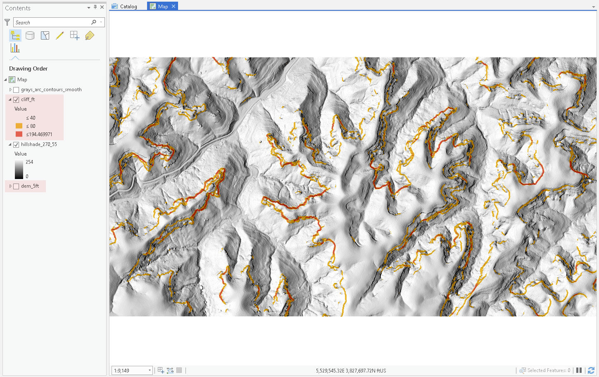 
*Bare-earth DEM (shown as a hillshade) and cliff heights*

We need to show elevation in a vector format to leverage Mapbox's speedy tile mapping service. The traditional method of showing elevation changes on a map is through contouring, creating lines of equal elevation.

The processing workflow will be as follows:

1. Do **Focal Statistics** on our bare-earth DEM to help smooth contours with the *mean* (average) statistic.
2. **Contour** to make elevation contours with a 20-foot interval (or 10-ft interval).
3. **Field Calculator** to make index contours for every 100 feet. An index contour has an attribute that allows us to symbolize it differently on the map.
4. Use the **Clip** tool to reduce the size of the area to the buffered area of interest and export Shapefile of contours that will load into Mapbox.


### Creating elevation contours

Let's first walk through making contours using our unmodified DEM. We'll show a common problem in making contours from high-resolution DEMs. First, open the **Geoprocessing** tab and search for "Contours". You should find the following tool and add a **Contour interval** of "10" feet.

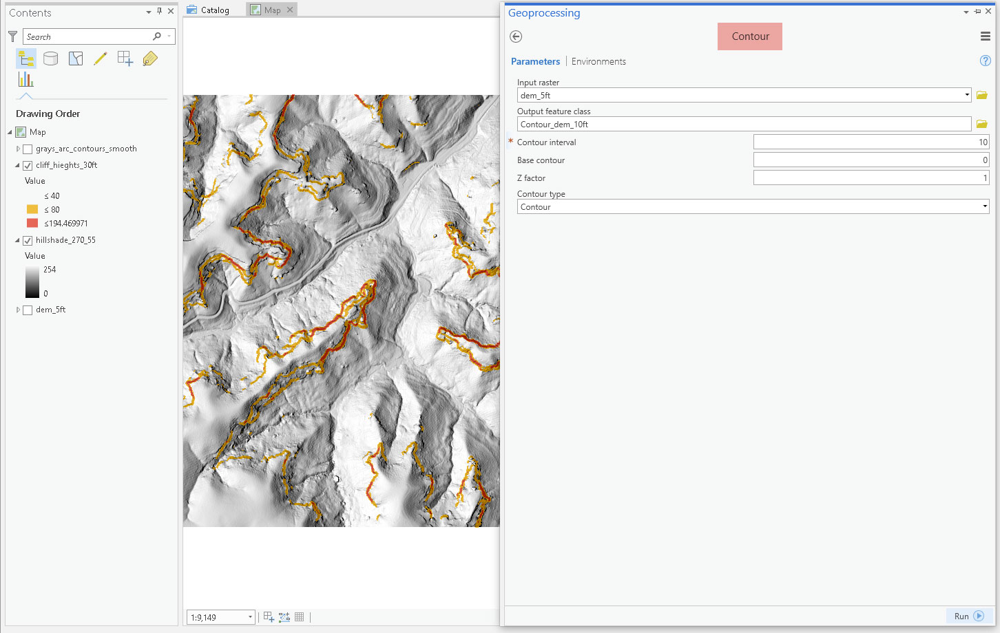 
*Contouring bare-earth DEM*

The contours produced might initially look good, but when you zoom into the scene, the contours start to appear jagged. This is not a pleasant look.

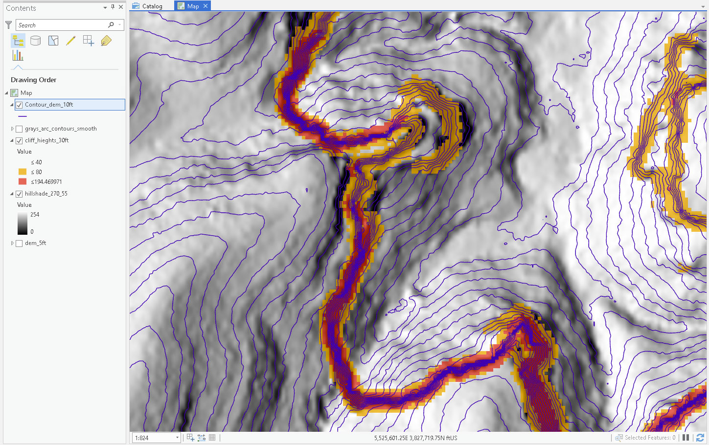 
*Default contours are not smooth*

We can use the focal statistics tool to average elevation in a neighborhood. By reducing surface 'ups and downs,' the contours will curve more gently. This is another circumstance where we might have to iterate through a few different parameters to get the right contour smoothness. Where's my Python!

Open **Focal Statistics** tool. Select the **Circle** neighborhood with a radius of 3 cells and select the **Mean** for the Statistic type.

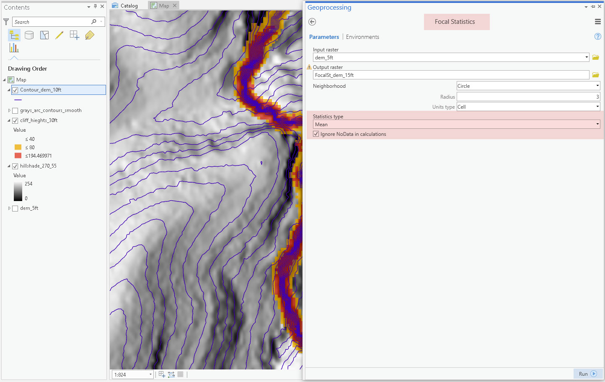 
*Focal statistics will smooth the DEM*

The output will be a DEM with a much smoother surface, though it might not look much different than the input DEM. However, if you were to hillshade the new DEM, the output raster would look too smooth. Add the output of the focal statistic tool to the input of the contour tool. Rerun the contour tool.

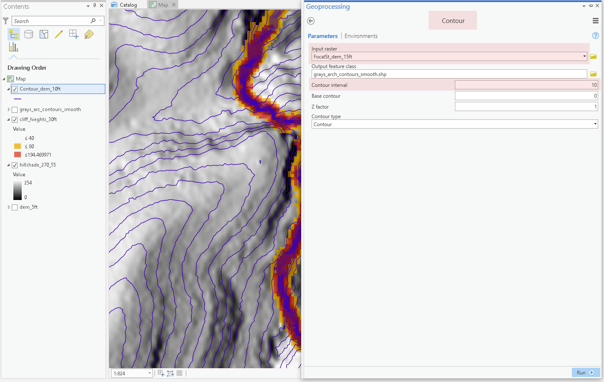 
*Using the focal statistics raster for contouring*

The output contours should look nice. If not, increase the radius by 1 or 2 cells. If it looks too generalize, reduce the radius.

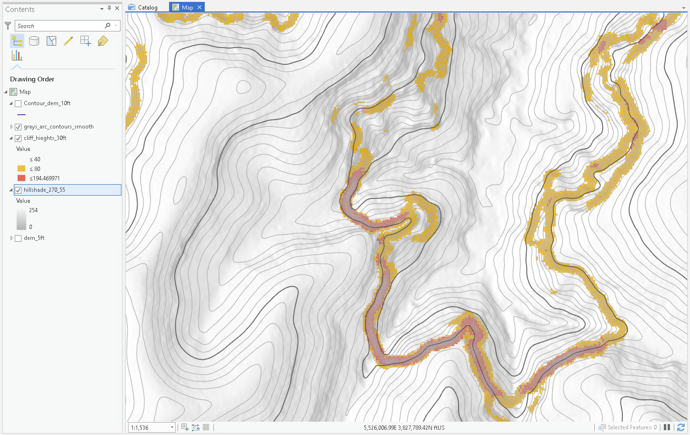 
*New contours from focal statistics raster*

#### Attribute index contours

Notice how the above contours have a more prominent contour every 100 feet? These are called index contours and help a user understand the topography. Open the contour layer's attribute table by right-clicking the layer and select **Attribute Table**.

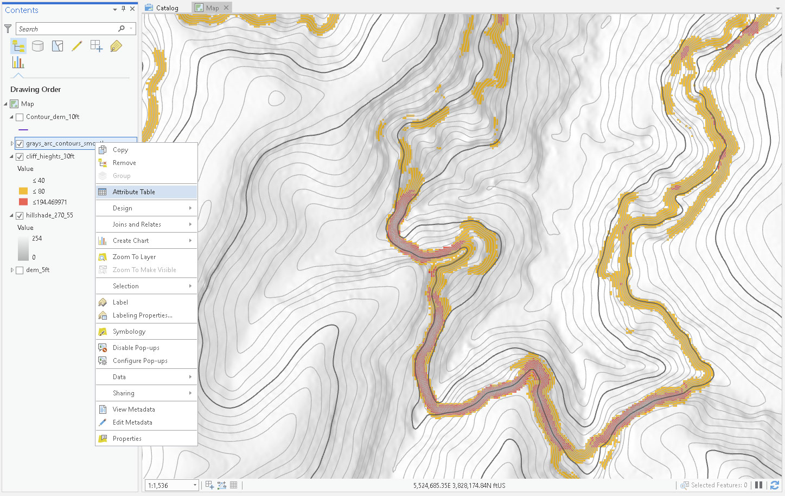 
*Open attribute table*

The attribute table should show a few attributes with *CONTOUR* being the elevation. 

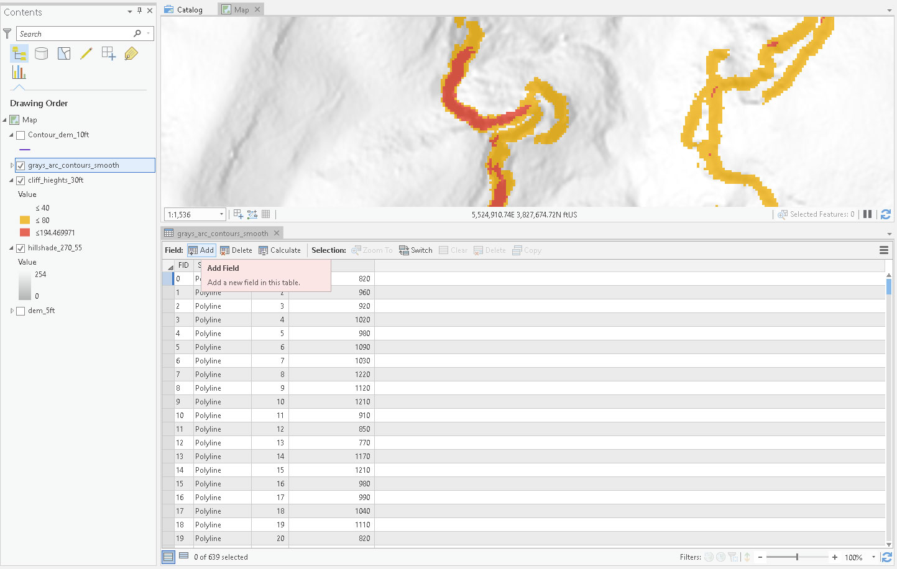 
*Add new field*

Let's add a new field called "index" and click **Save** in the **Fields** tabs.

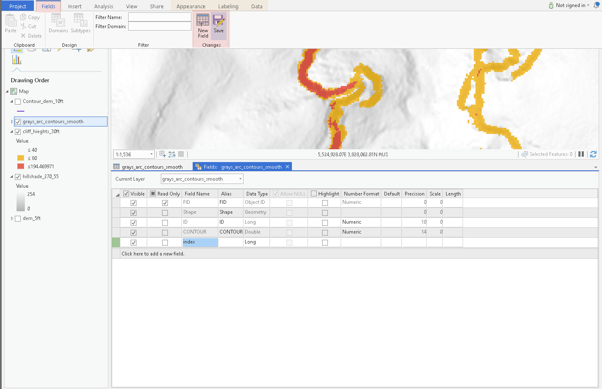 
*The new field is called "index"*

Right-click the new field's name to access **Calculate Field** to calculate a value that represents a contour is an index contour. We need only two values. "1" represents an index contour, while "0" will not be an index contour.

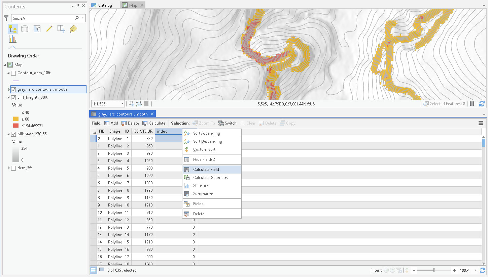 
*The new field is called "index"*

We could use SQL to select each contour directly, e.g., `CONTOUR = 1100`, and then calculate the *index* field with "1". With the new knowledge of Python, we can programmatically calculate values. To use Python, we need to add function in the Field Calculator's **Code Block** and pass a value as an argument. The value in our case is a field name, which needs has a special syntax here. We wrap field names in exclamation marks, `!`.

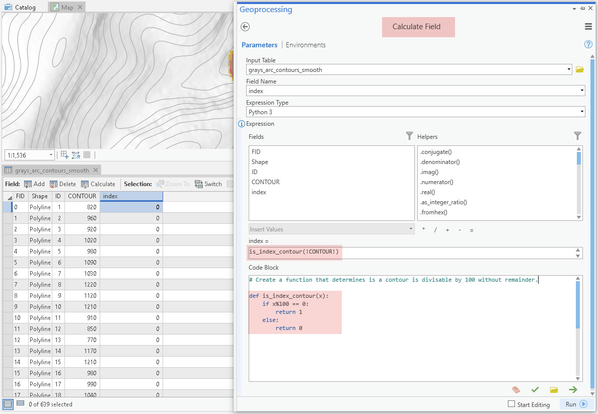 
*Using Python in Field Calculator*

Let's look at the calculation in more detail. The Python in the code block is:

```Python
# Define a function that takes one argument. 
# Function and variable names are arbitrary.
# If the value passed to the function is divisible by 100 without remainder, it's an index contour. The function will return a 1. If not, it will return a 0.
def is_index_contour(x):
    if x%100 == 0: # The modulo expression!
        return 1
    else:
        return 0
```

In the expression block (directly above the code block) call the new function and pass a field name as the argument. 

```Python
is_index_contour(!CONTOUR!)
```

The calculator will go feature by feature (record by record) and run this Python statement on its *CONTOUR* value. You now have a field to symbolize your layer in Mapbox easily.

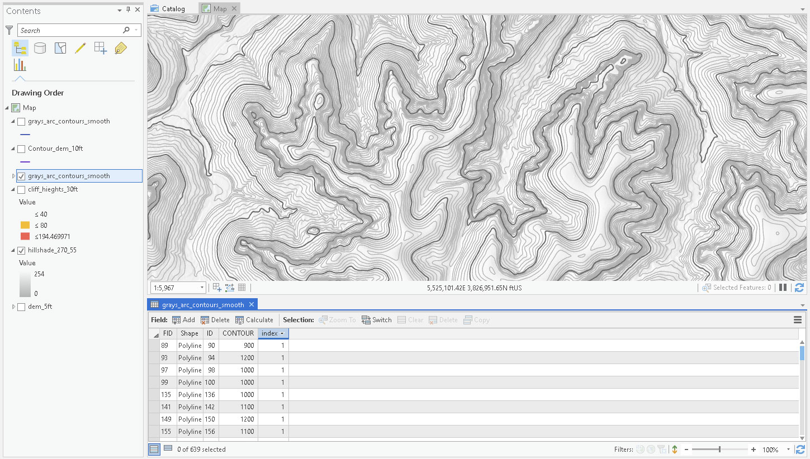 
*Smooth contours with an index*

If you want to symbolize the layer in ArcGIS, select the layer in the **Contents** pane and then select the **Symbology** pane. In the **Primary Symbology** dropdown, select **Unique Values**. ArcGIS will automatically assign a color and stroke width.

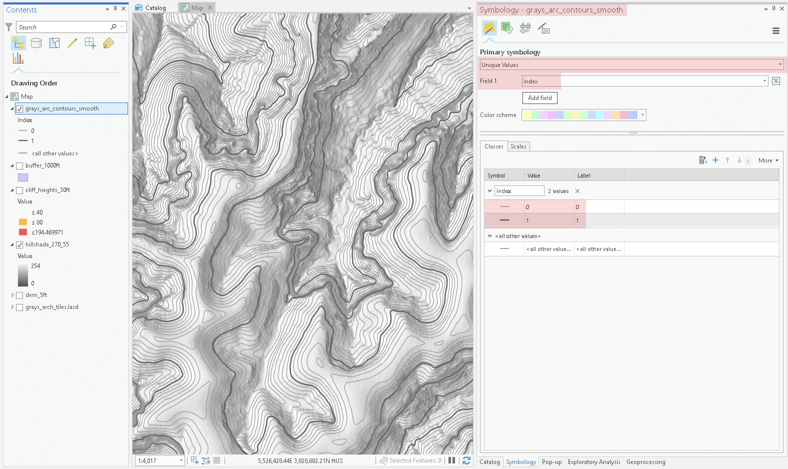 
*Symbology pane*

Click the symbol for each class. You can then select your desired contour color and width.

#### Clip contours 

While Mapbox can handle large layers, it is easier to start with smaller areas. Plus, we need to convert our layer to a Shapefile format for upload to Mapbox. Find the vector **Clip** tool and clip to the buffer area polygon produced in an earlier lab.

Make sure the output layer is a Shapefile format by selecting a folder outside of a geodatabase and appending `.shp` to the end of the file name.

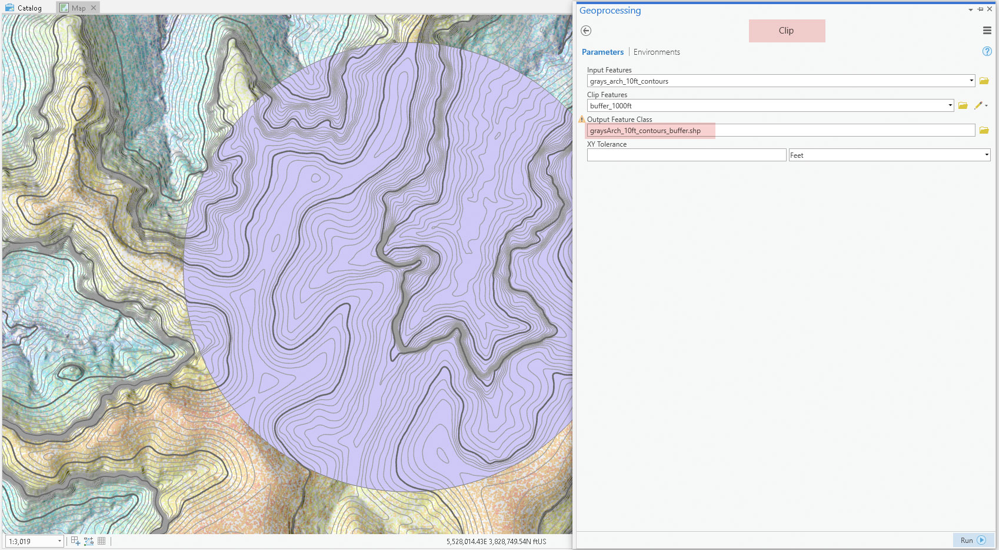 
*Clip contours to buffer polygon*

We're now ready to jump into Mapbox and start making our online map.

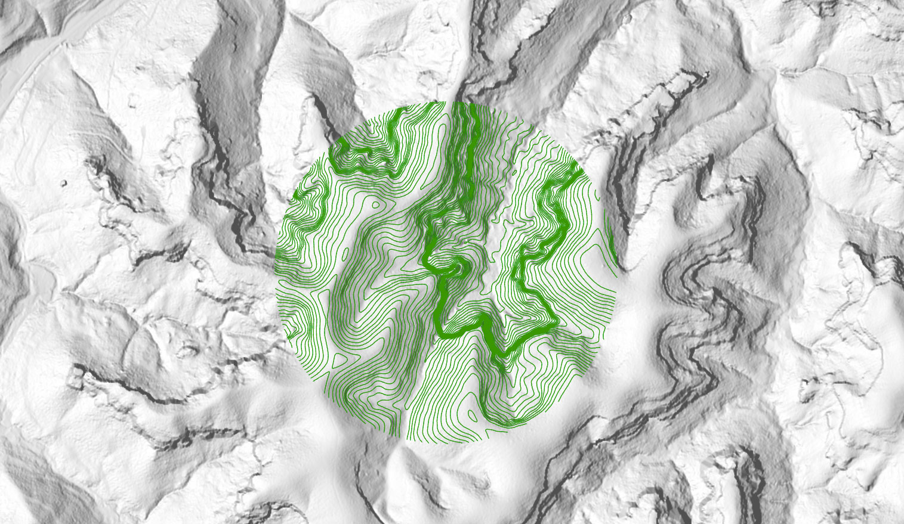 
*Clipped contours saved as a Shapefile format*


### Preparing data for upload to Mapbox

This concludes our raster analysis workflow. Let's prepare our arches and contour data for upload to Mapbox. A GeoJSON must be uploaded as a single uncompressed file. Review the addendum for more information about the GeoJSON format.

The *arches_us.geojson* is ready to upload! No need to modify the file.


The Shapefile needs to be bundled into a single .zip file. Select all of the members of the multi-file format and right-click to **Send to > Compressed (zipped) Folder** (Windows OS)


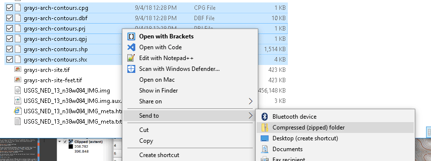 
*Windows OS: Compress the multi-file Shapefile format to a single .ZIP file*